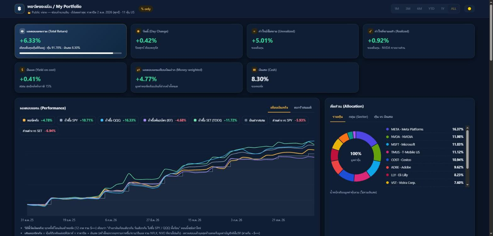
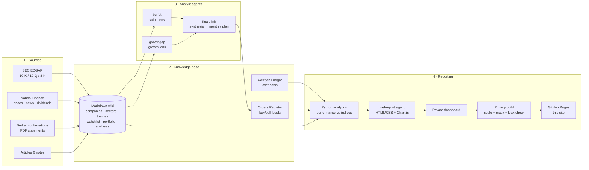

# Portfolio Dashboard — an AI-agent research pipeline, end to end

**Live page → https://wisep10.github.io/portfolio-dashboard/**

This dashboard is the last step of a personal investment-research system I designed and run myself. The system works like a small analyst team made of AI agents. They collect raw financial data, keep a structured knowledge base up to date, argue about each stock from two different angles, and turn the decision into a monthly plan. A reporting agent then renders this dashboard.

The page you see is the **public, privacy-safe build**. Every dollar amount and share count has been taken out. Only percentages, portfolio weights and per-share prices are left.

> Built with **Claude Code** (Anthropic's agentic coding tool) as the orchestrator, plus Python, the SEC EDGAR / Yahoo Finance data sources, and Chart.js.
> I own the system design, the rules and the data-integrity checks. The LLM agents do the reading, filing and drafting.

---

## 1. Architecture at a glance

---

## 2. The pipeline, step by step

### Step 1 — Collect raw data
All sources go into a `raw/` folder that is **never edited**. Every later step can always be traced back to an original document.

| Source | How it is collected |
|---|---|
| SEC filings (10-K, 10-Q, 8-K + press-release exhibits) | `secfetch` agent → `fetch_filing.py` (edgartools): ticker → CIK → latest filings → saved as the original document plus a clean text version |
| News | `news` agent → `fetch_news.py` (yfinance) + web search. It filters out noise and off-topic headlines and keeps at most 3 relevant items per ticker |
| Live prices | Yahoo Finance quotes through an MCP server. They are fetched when an analysis runs and never typed in by hand |
| Dividends | `fetch_dividends.py` finds payments whose pay date has passed and estimates them, then asks the user for the real broker figure |
| Broker statements | Password-protected PDFs are unlocked locally. The password is entered in a pop-up and never stored |

### Step 2 — Build the knowledge base
An LLM-maintained **Obsidian-style Markdown wiki** follows a written schema. Every page has YAML frontmatter, a fixed section layout per page type and cross-links (`[[TICKER]]`, `[[Theme]]`). Slash-commands do the routine work:

- `/ingest` reads a source and updates every affected page. For filings it reads five fixed sections: business, risk factors, use of proceeds, related-party transactions and MD&A.
- `/research` runs the full single-ticker pipeline. `/compare`, `/screen` and `/query` handle the questions.
- `/trade` records buys and sells. `/update-port` refreshes prices and runs the dividend check.
- `/lint` runs a wiki health check: orphan pages, stale data, contradicting claims.

Current size: about 18 company pages, 12 watchlist names, 47 dated analyses and an append-only activity log with 200+ entries since June 2026.

### Step 3 — Analyse from two opposing angles, then decide
Three specialised sub-agents each have their own written instructions:

1. **`buffet`** (value investing) scores the business on a **15-category fundamental checklist**: moat, balance sheet, cash flow, management, valuation, margin of safety and more.
2. **`growthgap`** (growth investing) looks for the gap between what the market expects and what the company could realistically deliver in 1–3 years. It then tests that story against hard numbers (revenue/EPS growth, ROIC, cash flow) to screen out hype.
3. **`finalthink`** (chief strategist) reconciles the two views, settles disagreements and produces a **monthly DCA (dollar-cost averaging) plan**. The plan says how much to put into each stock, whether to add to an existing position or open a new one, and the entry levels.

Decision rules learned the hard way are written into the system. One example is a 5-point check before buying more of a stock that is below its average cost. Another is a set of "earnings-window" rules for what to do around quarterly results.

### Step 4 — Keep the numbers honest
This is the part I care about most. Every rule here exists because something actually went wrong:

| Problem that actually happened | Rule / tool that now prevents it |
|---|---|
| A cancelled buy level survived in 8 different files and was reported as "ready to fire" | **Single source of truth.** All live levels sit in one Orders Register. `check_consistency.py` flags any old level that is still repeated elsewhere |
| Prices copied into many pages went out of date | **Store facts, fetch prices.** The ledger stores only cost basis. Anything that depends on price is calculated from a live quote at analysis time |
| 11 dividend payments went unrecorded for 5 months, because no event ever reports them | **Dividend check on every refresh.** Each amount is validated: `amount ÷ shares ÷ 0.85` (after 15% US withholding tax) must equal the declared rate per share |
| A "trim to 12%" rule could not be carried out, because the broker only sells whole shares | Before writing any sell rule, check that the broker can actually execute it |
| Doubt about whether total P/L was correct | Two independent methods are reconciled: P/L summed position by position vs. the account rebuilt from cash flows. They agree to within cents |

### Step 5 — Analytics behind the charts
- **`real_vs_index.py`** rebuilds the **real account value week by week** from every buy, sell, dividend and deposit. It then simulates putting *the same deposits on the same dates* into SPY, QQQ, US Treasuries (IEF) and the Thai SET50. SET50 uses TDEX converted to USD, because Yahoo has no history for the SET index itself. This is the fair, money-weighted way to answer "did my stock picking beat just buying the index?"
- **`perf_compare.py`** builds a separate "basket" view: today's holdings held unchanged over 1M to inception, compared with SPY and QQQ.

### Step 6 — Render the dashboard
A **`webreport` agent** writes `wiki/overview.md` and the analytics JSON into one self-contained HTML file:

- vanilla JS + Chart.js
- no build step, works offline
- dark and light themes
- sortable holdings table, allocation donut, dividend history, earnings calendar and the order tracker

Each render runs self-checks: JS syntax, sums that must reconcile, and a headless-browser screenshot.

### Step 7 — Publish safely (this repo)
The private dashboard contains real account figures, so the public version comes from a separate build script:

1. **Data layer.** Every dollar amount and share count in the embedded data is multiplied by a random factor that is never saved. Percentages and weights stay correct, but the page source holds no real amounts.
2. **Display layer.** The page code is patched to show % instead of $, columns that reveal size are removed, and any `$` figure left in the text is masked.
3. **Fail-closed.** Each patch must match exactly once. If the dashboard layout changes, the build **stops** rather than risk a leak.
4. **Leak test.** Before writing, the build scans the output for real values and refuses to publish if it finds one.
5. **Separate repository.** Only the finished static page is pushed. The wiki, raw documents and scripts never leave the machine.

---

## 3. Tech stack

| Layer | Tools |
|---|---|
| Agent orchestration | Claude Code: custom sub-agents, slash-commands, project rules in `CLAUDE.md`, MCP tools |
| Data | SEC EDGAR (edgartools), Yahoo Finance (yfinance + MCP quote server), broker PDFs (Poppler / pypdf) |
| Analytics | Python 3 + pandas: weekly time-series rebuild, FX conversion, benchmark simulation |
| Knowledge base | Markdown + YAML frontmatter, Obsidian wiki-links |
| Front-end | HTML / CSS (custom design tokens, light/dark), vanilla JS, Chart.js |
| Delivery | Git, GitHub CLI, GitHub Pages |

## 4. What this project demonstrates

- **Designing agent workflows.** I split the work into specialist agents with clear inputs, outputs and read/write permissions (analysts are read-only; only the main agent writes).
- **Data engineering discipline.** The system has immutable raw data, one source of truth per fact, reconciliation checks and an audit log.
- **Financial analysis.** It covers filing analysis, valuation, money-weighted vs. time-weighted returns and benchmark selection.
- **Turning incidents into controls.** Every rule in Step 4 came from a real mistake that was found and fixed.
- **Privacy by design.** Personal financial data is shared publicly without exposing it, and the build blocks publishing rather than leaking.

---

### สรุปภาษาไทย
Dashboard นี้คือปลายทางของระบบวิจัยการลงทุนส่วนตัวที่ใช้ AI agent หลายตัวทำงานร่วมกัน ขั้นตอนมีดังนี้:

1. ดึงเอกสาร SEC, ข่าว และราคาเข้าคลังข้อมูลดิบ
2. AI จัดระเบียบเป็นวิกิ (Markdown) แยกเป็นหน้าบริษัท ธีม และพอร์ต
3. Agent สายเน้นคุณค่า (buffet) กับสายเติบโต (growthgap) วิเคราะห์คนละมุม แล้ว finalthink สรุปเป็นแผนลงทุนรายเดือน
4. สคริปต์ Python สร้างมูลค่าพอร์ตจริงย้อนหลังรายสัปดาห์ เทียบกับการเอาเงินก้อนเดียวกันไปซื้อ SPY / QQQ / พันธบัตร / SET50
5. webreport agent สร้างหน้า HTML นี้
6. ก่อนเผยแพร่ ระบบซ่อนจำนวนเงินและจำนวนหุ้นทั้งหมด และมีตัวตรวจกันข้อมูลหลุด

---

*Personal project for education and portfolio purposes only. Not investment advice.*
